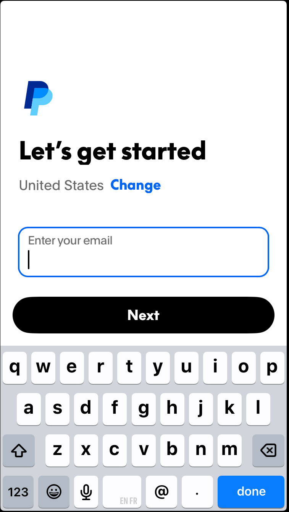
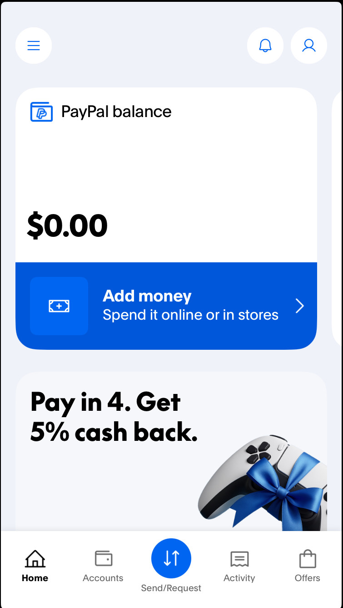
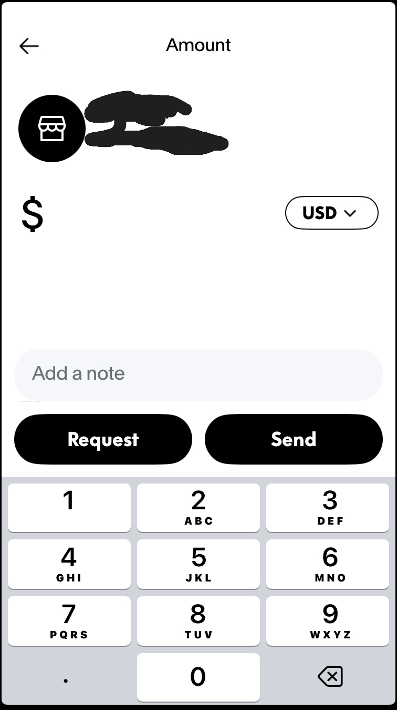

# How to Send Money Through the PayPal App

**Author:** Rulonda Fuller 

**Version:** 1 

**Last Updated**: November 10, 2025

## Overview

This guide will teach you how to send money to friends or family via the PayPal mobile app.

## Audience

This guide is intended for PayPal users who want to send money to friends or family using a mobile device or tablet.

## Prerequisites

Install the PayPal app via the App Store on your mobile device or tablet, set up a PayPal account, and add your bank information or debit/credit card to your account before using this guide.

## Instructions:

1. Open the PayPal app on your mobile device or tablet.
2. Enter the **email address** associated with your PayPal account and select the **Next** button.
   
   

3. Enter your **email address** and **password**. 
4. Click the **Log In** button. The main display appears.
5. Click the **Send/Request** button.
   
   
   
6. Enter the **name**, **username**, **email address**, or **phone number** of the person you're sending money to in the search bar.
7. Click the photo of the correct person.
8. Enter the amount you want to send using the numeric pad. (Add an optional note if you want to tell the receiver what the money is for.)
   
    

9.  Click the **Send** button. A confirmation email will be sent to your email address.
